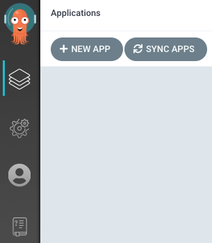
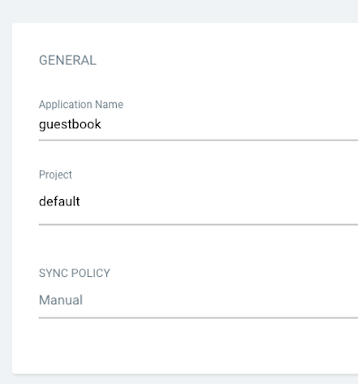
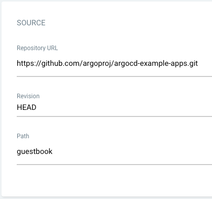
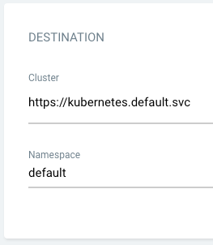
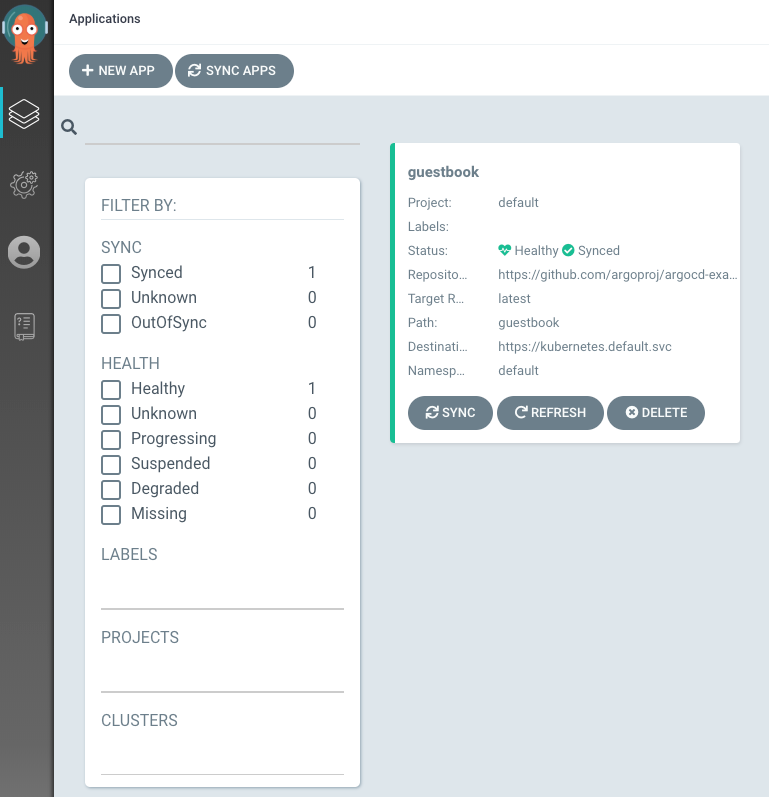
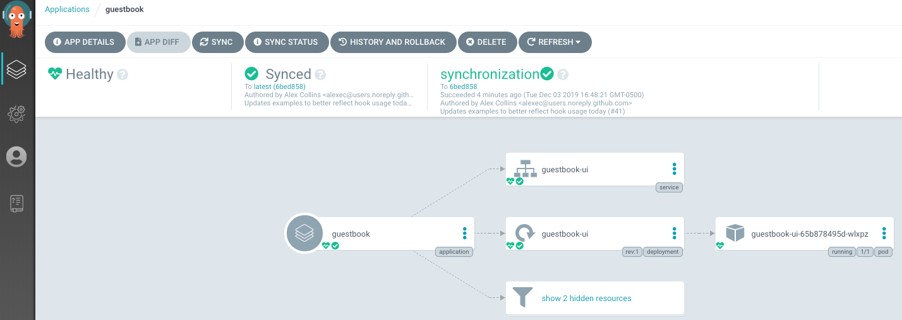

# ArgoCD Installation Guide

## 🧩 Installation
To install ArgoCD on a Linux OS, we can use two different ways: Linux-Based, and Helm-Based commands. Some part of 
installation in both ways are the same. So, while installing the second way, we just explain the difference part.


### 🧩 Install ArgoCD from Linux commnads:

### 1. Install kubectl (if not already installed)
Argo CD requires access to a Kubernetes cluster. Install kubectl for `arm64`:
```shell
curl -LO "https://dl.k8s.io/release/$(curl -L -s https://dl.k8s.io/release/stable.txt)/bin/linux/arm64/kubectl"
chmod +x kubectl
sudo mv kubectl /usr/local/bin/
kubectl version --client
```

### 2. Install Argo CD CLI
Download the CLI for `arm64`:
```shell
VERSION=$(curl --silent "https://api.github.com/repos/argoproj/argo-cd/releases/latest" | grep '"tag_name":' | sed -E 's/.*"v([^"]+)".*/\1/')
curl -sSL -o argocd https://github.com/argoproj/argo-cd/releases/download/v${VERSION}/argocd-linux-arm64
chmod +x argocd
sudo mv argocd /usr/local/bin/
argocd version
```

### 3. Install Argo CD on Kubernetes
Create the namespace and install the manifests:
```shell
kubectl create namespace argocd
kubectl apply -n argocd -f https://raw.githubusercontent.com/argoproj/argo-cd/stable/manifests/install.yaml
```
This will install the latest Argo CD release in your cluster.

**Note:**
Default namespace for kubectl config must be set to argocd. This is only needed for the following commands since the 
previous commands have -n argocd already: `kubectl config set-context --current --namespace=argocd`


### 4. Access the Argo CD API server
By default, the Argo CD API server is not exposed with an external IP. To access the API server, choose one of the 
following techniques to expose the Argo CD API server:

#### Service Type Load Balancer
Change the argocd-server service type to `LoadBalancer`:
```shell
kubectl patch svc argocd-server -n argocd -p '{"spec": {"type": "LoadBalancer"}}'
```

After a short wait, your cloud provider will assign an external IP address to the service. You can retrieve this IP with:
```shell
kubectl get svc argocd-server -n argocd -o=jsonpath='{.status.loadBalancer.ingress[0].ip}'
```

#### Ingress
Follow the [ingress documentation](https://argo-cd.readthedocs.io/en/stable/operator-manual/ingress/) on how to 
configure Argo CD with ingress.

#### Port Forwarding
Kubectl port-forwarding can also be used to connect to the API server without exposing the service.
```shell
kubectl port-forward svc/argocd-server -n argocd 8080:443
```
The API server can then be accessed using https://localhost:8080


### 5. Login Using The CLI
The initial password for the `admin` account is auto-generated and stored as clear text in the field `password` in a 
secret named `argocd-initial-admin-secret` in your Argo CD installation namespace. You can simply retrieve this password 
using the `argocd` CLI:
```shell
argocd admin initial-password -n argocd
```

Using the username admin and the password from above, login to Argo CD's IP or hostname:
```shell
argocd login localhost:8080 --username admin --password <password> --insecure
```

Change the password using the command:
```shell
argocd account update-password
```

### 6. Register A Cluster To Deploy Apps To (Optional)
This step registers a cluster's credentials to Argo CD, and is only necessary when deploying to an external cluster. 
When deploying internally (to the same cluster that Argo CD is running in), `https://kubernetes.default.svc` should be 
used as the application's K8s API server address.

First list all clusters contexts in your current kubeconfig:
```shell
kubectl config get-contexts -o name
```

Choose a context name from the list and supply it to `argocd cluster add CONTEXTNAME`. For example, for docker-desktop 
context, run:
```shell
argocd cluster add docker-desktop
```

The above command installs a ServiceAccount (argocd-manager), into the kube-system namespace of that kubectl context, 
and binds the service account to an admin-level ClusterRole. Argo CD uses this service account token to perform its 
management tasks (i.e. deploy/monitoring).


### 7. Create An Application From A Git Repository
#### Creating Apps Via CLI
First we need to set the current namespace to argocd running the following command:
```shell
kubectl config set-context --current --namespace=argocd
```

Create the example guestbook application with the following command:
```shell
argocd app create guestbook \
  --repo https://github.com/argoproj/argocd-example-apps.git \
  --path guestbook \
  --dest-server https://kubernetes.default.svc \
  --dest-namespace default
```

#### Creating Apps Via UI
Open a browser to the Argo CD external UI, and login by visiting the IP/hostname in a browser. After logging in, click 
the **+ New App button** as shown below:    


Give your app the name `guestbook`, use the project `default`, and leave the sync policy as Manual:  


Connect the https://github.com/argoproj/argocd-example-apps.git repo to Argo CD by setting repository url to the github 
repo url, leave revision as HEAD, and set the path to `guestbook`:  


For Destination, set cluster URL to `https://kubernetes.default.svc` (or `in-cluster` for cluster name) and namespace 
to `default`:  


After filling out the information above, click Create at the top of the UI to **create** the `guestbook` application:  


### 8. Sync (Deploy) The Application
#### Syncing via CLI
Once the guestbook application is created, you can now view its status:
```shell
$ argocd app get guestbook
Name:               guestbook
Server:             https://kubernetes.default.svc
Namespace:          default
URL:                https://10.97.164.88/applications/guestbook
Repo:               https://github.com/argoproj/argocd-example-apps.git
Target:
Path:               guestbook
Sync Policy:        <none>
Sync Status:        OutOfSync from  (1ff8a67)
Health Status:      Missing

GROUP  KIND        NAMESPACE  NAME          STATUS     HEALTH
apps   Deployment  default    guestbook-ui  OutOfSync  Missing
       Service     default    guestbook-ui  OutOfSync  Missing
```

The application status is initially in OutOfSync state since the application has yet to be deployed, and no Kubernetes 
resources have been created. To sync (deploy) the application, run:
```shell
argocd app sync guestbook
```

This command retrieves the manifests from the repository and performs a kubectl apply of the manifests. The guestbook 
app is now running, and you can now view its resource components, logs, events, and assessed health status.

#### Syncing via UI
On the Applications page, click on Sync button of the guestbook application:


A panel will be opened and then, click on *Synchronize* button. You can see more details by clicking at the guestbook 
application:



### 🧩 Install ArgoCD from Helm Chart:
#### Step 1: Install Argo CD
```shell
kubectl create namespace argocd
helm repo add argo https://argoproj.github.io/argo-helm
helm repo update

helm install argocd argo/argo-cd --namespace argocd
```

Wait for pods:
```shell
kubectl get pods -n argocd
```

#### Step 2: Access Argo CD UI
Port-forward:
```shell
kubectl -n argocd port-forward svc/argocd-server 8080:443 &
```

Access UI at 👉 https://localhost:8080

Get the admin password:
```shell
kubectl -n argocd get secret argocd-initial-admin-secret \
  -o jsonpath="{.data.password}" | base64 -d; echo
```
As I mentioned, other installation parts are the same and you can follow the above connection and syncing instructions.


## 🧩 Connect a k3s cluster to Argo CD
If Argo CD runs in another Kubernetes cluster (or externally via a VM, Docker, etc.), you must register your k3s cluster 
with Argo CD.


### 1. Get kubeconfig access to your k3s cluster
On the machine where you run the `argocd` CLI:
```shell
export KUBECONFIG=/etc/rancher/k3s/k3s.yaml
```

If your `k3s.yaml` file uses `127.0.0.1:6443` as server (default), change it to your node’s **real IP or DNS name**, 
e.g.:
```shell
sudo sed -i "s/127.0.0.1/$(hostname -I | awk '{print $1}')/" /etc/rancher/k3s/k3s.yaml
```
or edit manually:
```shell
server: https://<node-ip>:6443
```

### 2. Test connection
```shell
kubectl get nodes
```
(make sure it works)

### 3. Change the default k3s cluster name (optional)
Because of being `default` k3s cluster name as default, in order to make difference between your clusters, you can 
change default k3s cluster name from `default` to any name that you want (for example, k3s-cluster):

#### Export your kubeconfig:
```shell
cp ~/.kube/config ~/.kube/config.bak
```

#### Edit it manually:
```shell
sudo nano ~/.kube/config
```
Find this block:
```shell
clusters:
- cluster:
    certificate-authority-data: LS0tLS1CRUdJTiBDRV...
    server: https://127.0.0.1:6443
  name: default
```
Change name: `default` → name: `k3s-cluster`.

Then scroll down and update any context that references it:
```shell
contexts:
- context:
    cluster: k3s-cluster
    user: admin@default
  name: default
```
Optionally rename the context name too:
```shell
  name: k3s-cluster
```
Save and exit.

Check:
```shell
$ kubectl config get-contexts
CURRENT   NAME          CLUSTER       AUTHINFO
*         k3s-cluster   k3s-cluster   admin@default
```

### 4. Add the k3s cluster to Argo CD
You can list available contexts:
```shell
$ kubectl config get-contexts -o name
k3s-cluster
```
Then:
```shell
argocd cluster add k3s-cluster
```

Argo CD will create a `ServiceAccount`, `ClusterRole`, and `ClusterRoleBinding` in your k3s cluster to allow control 
from Argo CD.

When it succeeds:
```shell
$ argocd cluster list
SERVER                          NAME         VERSION  STATUS   MESSAGE                                                  PROJECT
https://192.168.2.25:6443       k3s-cluster           Unknown  Cluster has no applications and is not being monitored.  
https://kubernetes.default.svc  in-cluster            Unknown  Cluster has no applications and is not being monitored.  
```

